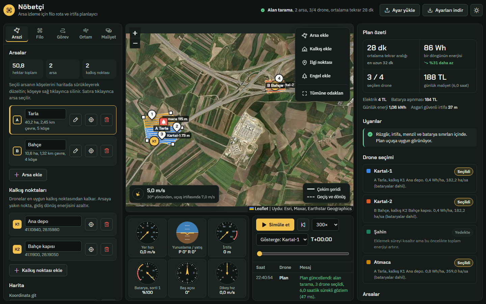

# Nöbetçi: Drone Rota ve İrtifa Planlayıcı

Bir veya birden fazla arsayı drone filosuyla sürekli izlemek için rota, irtifa ve drone seçimi planlayan tarayıcı uygulaması.
Yakıt ve enerji tasarrufu ile zaman tasarrufu arasındaki dengeyi siz seçersiniz; plan her değişiklikte yeniden hesaplanır.



**Teknoloji:** Bağımlılıksız (vanilla) JavaScript, Leaflet harita, Web Worker ile arka planda hesap. Çalıştırmak için yalnızca Node.js (18 veya üstü) gerekir.

## Hızlı başlangıç (Windows)

1. `1_KUR_VE_CALISTIR.bat` → Node.js yoksa kurar (winget), hesap motoru testlerini çalıştırır ve uygulamayı tarayıcıda açar.
2. Sonraki açılışlarda `2_BASLAT.bat` yeterlidir.
3. Tarayıcı açılmazsa **http://127.0.0.1:8080/** adresine gidin (8080 doluysa sunucu bir sonraki boş bağlantı noktasını kullanır ve adresi pencerede yazar).

Uydu haritası ve ikonlar internetten yüklendiği için internet bağlantısı gerekir.

### Elle çalıştırma (Windows, macOS, Linux)

```bash
npm start      # sunucuyu başlatır ve tarayıcıyı açar
npm test       # hesap motoru testleri
```

## Neler yapar

- **Birden fazla arsa ve kalkış noktası:** Haritada çizilir, sürüklenerek düzeltilir.
- **Otomatik drone seçimi:** Her drone, arsa ve kalkış noktası çifti için rüzgâr sınırı, menzil, iş hızı, hektar başına enerji, yedek batarya ve şarj süresi hesaplanır. Öncelik ayarına göre en uygun dronelar seçilir, gerisi nedeniyle birlikte yedekte gösterilir. İstenirse atama elle yapılır.
- **İrtifa belirleme:** Hedef görüntü çözünürlüğünden (cm/piksel) irtifa hesaplanır; en yüksek engel, güvenlik payı, arazi kot farkı ve yasal üst sınır (varsayılan 120 m) arasına çekilir. Aynı arsayı veya kalkışı paylaşan dronelar ayrı irtifa katmanlarında uçar.
- **Üç görev türü:** Alan tarama (bindirmeli şeritler), çevre devriyesi, ilgi noktası kontrolü (en kısa ziyaret sırası).
- **Sürekli gözlem:** Gözlem süresi boyunca döngüler tekrarlanır; batarya değişimi, yedek batarya ve şarj sırası planlanır. Her arsa için tekrar aralığı, görevdeki drone sayısı ve boş kalınan süre gösterilir.
- **Enerji modeli:** Çok rotorlu ve sabit kanat güç modelleri, rüzgârın irtifayla artışı, hava yoğunluğu, sıcaklığın bataryaya etkisi, dönüş kayıpları, benzinli dronelar için yakıt tüketimi.
- **Simülasyon:** Haritada canlı uçuş, 6 gösterge (hız, yönelim, irtifa, batarya, baş açısı, dikey hız) ve zaman damgalı kayıt tablosu.
- **Dışa aktarma:** Her drone için QGroundControl'ün açabileceği `.plan` görev dosyası; tüm ayarları JSON olarak indirme ve geri yükleme.

## Klasörler

| Klasör / dosya | İçerik |
|---|---|
| `uygulama/index.html` | Uygulamanın tamamı: arayüz, stiller ve `<script id="motor">` içindeki hesap motoru. |
| `testler/motor.test.js` | Hesap motoru testleri (`npm test`). |
| `araclar/csp-guncelle.js` | `index.html` içindeki betikler değişince güvenlik politikasındaki (CSP) özetleri yeniler (`npm run csp`). |
| `sunucu.js` | Yalnızca `uygulama/` klasörünü ve yalnızca bu bilgisayara (127.0.0.1) sunan küçük yerel sunucu. |
| `kurulum.ps1` | `1_KUR_VE_CALISTIR.bat` tarafından çalıştırılan kurulum betiği. |
| `docs/` | README görselleri. |

## Geliştirme notları

- `uygulama/index.html` içindeki bir betiği değiştirdikten sonra `npm run csp` çalıştırın; aksi halde tarayıcı güvenlik politikası betiği engeller.
- Hazır drone sınıfları yaklaşık değerlerdir. Filo sekmesine kendi dronelarınızın ağırlık, batarya ve kamera bilgilerini girin.
- Uygulama bir planlama aracıdır; drone'a canlı bağlanmaz. İndirilen `.plan` dosyasını uçuştan önce yer kontrol istasyonunda mutlaka kontrol edin ve yerel havacılık kurallarına uyun.

## GitHub'a yükleme

GitHub'da boş bir depo oluşturun (README eklemeden), sonra bu klasörde:

```bash
git init
git add .
git commit -m "Nöbetçi drone planlayıcı"
git branch -M main
git remote add origin https://github.com/KULLANICI_ADI/DEPO_ADI.git
git push -u origin main
```

## Yararlanılan kaynaklar

Rota ve enerji fikirleri için incelenen açık kaynak projeler: udacity/CppND-Route-Planning-Project ve a-ngo/route-planning (A\*), cuntou0906/Route-Planning (GA, PSO, ACO), RoutingKit (CH, CCH), Telecominfraproject/oopt-gnpy, Dungyichao/Electric-Vehicle-Route-Planning (enerji ödüllü rota), Kasheftin/RoutePlanner (harita arayüzü). Arayüz düzeni Mali03/UAV-interface yer kontrol istasyonundan uyarlanmıştır. Döner kanat güç modeli: Zeng, Xu ve Zhang (2019).
